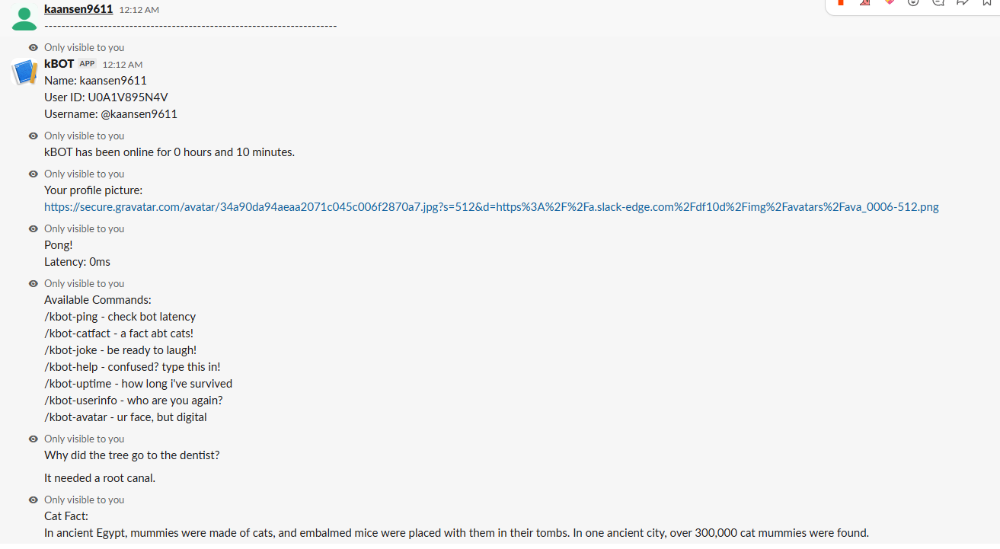

# kBOT
my first Slack bot!

## About the Project
kBOT is a simple Slack bot that I built to learn how backend systems and Slack APIs work.  
It listens to slash commands and responds with different features like jokes, cat facts, and user information.  

This project helped me understand how to:
- Handle HTTP requests from Slack
- Work with slash commands
- Build a working Node.js backend
- Keep a bot running on a server

## Avaliable Commands
* /kbot-ping - check bot latency
* /kbot-catfact - a fact abt cats!
* /kbot-joke - be ready to laugh!
* /kbot-help - confused? type this in!
* /kbot-uptime - how long i've survived
* /kbot-userinfo - who are you again?
* /kbot-avatar - ur face, but digital

## How it works
When a command is used in Slack, Slack sends a request to my bot server.  
The server processes the command and returns a response back to Slack in real time.

## Image

